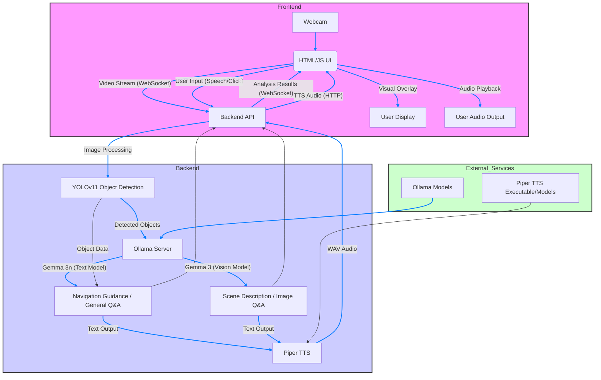

# Technical Write-up: Smart Eyes with Gemma

## 1. Introduction

Smart Eyes with Gemma is an innovative assistive system designed to enhance the independence and safety of visually impaired individuals. This project leverages cutting-edge on-device AI capabilities, specifically Google's Gemma 3n and Gemma 3 models via Ollama, combined with real-time object detection (YOLOv11) and high-quality speech synthesis (Piper TTS). Our goal is to provide a comprehensive, private, and real-time environmental awareness solution that goes beyond traditional assistive devices.

This technical write-up details the architecture, implementation, and the specific utilization of Gemma models within Smart Eyes with Gemma, highlighting the challenges overcome and the rationale behind our technical decisions. **While the ultimate vision for Smart Eyes with Gemma is to be an embedded system directly integrated into smart assistive devices such as intelligent canes, smart glasses, or purpose-built wearable devices for seamless, always-on assistance, this current implementation is developed as a web-based application. This approach was chosen to overcome immediate technical constraints related to hardware integration and to facilitate an accessible online demo for the Gemma 3n Impact Challenge, while demonstrating the viability of Gemma 3n's on-device capabilities for future embedded deployment.**

## 2. System Architecture

Smart Eyes with Gemma operates on a client-server architecture, enabling real-time video processing and AI-powered voice guidance.



### 2.1. Frontend (Client-side - `index.html`)

- **Technology**: HTML, Tailwind CSS, JavaScript
- **Functionality**:
    - **Video Stream Capture**: Captures real-time video frames from the user's webcam.
    - **UI Controls**: Provides intuitive buttons for starting/stopping analysis, switching cameras, requesting scene descriptions, asking questions, and toggling speech recognition language (English/Korean).
    - **Real-time Overlay**: Draws bounding boxes and labels on a canvas overlaid on the video feed, showing detected objects and their status.
    - **Status Display**: Shows real-time alerts (CRITICAL, WARNING, INFO) and guide messages.
    - **Audio Playback**: Plays AI-generated voice guidance and answers.
    - **Speech Recognition**: Utilizes the Web Speech API (SpeechRecognition) for user voice input.

### 2.1.1. UI/UX and Accessibility Design Principles

Our frontend design prioritizes accessibility and a clear user experience for visually impaired individuals. Key design principles include:

- **Concise and Intuitive UI**: The interface is kept clean and uncluttered, focusing on essential controls. This minimizes cognitive load and makes navigation straightforward.
- **Clear Visual and Auditory Feedback**:
    - **Visual Cues**: Real-time bounding boxes and status overlays provide visual context for sighted assistants or for later review. Critical alerts are enhanced with a vibrating cane icon and a distinct red border around the video feed.
    - **Auditory Cues**: Primary interaction relies on high-quality voice guidance from Piper TTS. Distinct warning and critical sound effects provide immediate, non-verbal alerts for urgent situations.
- **Voice Interaction Focus**: Recognizing that voice is a primary mode of interaction for visually impaired users, the system heavily relies on speech commands for asking questions and receiving information.
- **Multilingual Support**: The ability to dynamically switch between English and Korean for speech recognition (`langSwitchButton`) enhances usability for a broader user base and caters to diverse linguistic needs.
- **Accessible Button Design**: Control buttons are designed to be large, clearly labeled (with icons), and well-spaced, making them easy to locate and activate by touch or with screen readers.

*A screenshot of the Smart Eyes with Gemma's main web interface, showing the video feed, overlay, and control buttons.*

### 2.2. Backend (Server-side - FastAPI)

- **Technology**: Python (FastAPI, Uvicorn)
- **Functionality**:
    - **API Endpoints**: Exposes RESTful APIs for scene description, question answering, and TTS generation. Below is an example of a FastAPI endpoint for scene description:
    
    ```python
    @router.post("/describe_scene", response_model=QuestionResponse, summary="Describe the surrounding scene")
    async def describe_scene(
        file: UploadFile = File(..., description="Image frame at the time of scene description request")
    ):
        """
        Generates a description of the surrounding scene based on current visual information.
        """
        image_bytes = await file.read()
        if not image_bytes:
            raise HTTPException(status_code=400, detail="Image file is empty for scene description.")
    
        description = services.describe_scene_with_ollama(image_bytes)
        return QuestionResponse(answer=description)
    ```
    
    - **WebSocket (`/ws/analyze`)**: Establishes a persistent connection with the frontend for real-time video frame reception and analysis result transmission. This is the core communication channel for continuous environmental awareness.
    
    ```python
    @router.websocket("/ws/analyze")
    async def websocket_analyze(websocket: WebSocket):
        """
        Receives frames in real-time via WebSocket and sends analysis results to the client.
        """
        await websocket.accept()
        try:
            while True:
                image_bytes = await websocket.receive_bytes()
                detected_objects = services.analyze_image_with_yolo(image_bytes)
                guide_info = services.get_risk_based_guide(detected_objects)
                response = AnalysisResponse(
                    objects=detected_objects,
                    guide_message=guide_info["guide_message"],
                    alert_level=guide_info["alert_level"]
                )
                await websocket.send_json(response.dict())
        except WebSocketDisconnect:
            print("WebSocket client disconnected.")
        # ... error handling ...
    ```
    
    - **Image Processing**: Receives raw image bytes, decodes them, and prepares them for YOLO analysis.
    - **Model Orchestration**: Manages the interaction between YOLO, Ollama (Gemma models), and Piper TTS.

### 2.3. Core Logic & AI Services (`services.py`)

- **YOLOv11 Object Detection**:
    - **Model**: Ultralytics YOLOv11 (`yolov11n.pt`) is used for fast and accurate real-time object detection. The model is loaded once at startup:
    
    ```python
    from ultralytics import YOLO
    from .config import settings
    
    try:
        yolo_model = YOLO(settings.YOLO_MODEL_PATH)
        print(f"YOLO model loaded successfully: {settings.YOLO_MODEL_PATH}")
    except Exception as e:
        print(f"Failed to load YOLO model: {e}")
        yolo_model = None
    ```
    
    - **Tracking & Analysis**: Tracks detected objects across frames, calculates their size ratio over time to determine approach status (Fast Approaching, Approaching, Stationary), and identifies their direction (left, center, right).
- **Ollama Integration (Gemma AI)**:
    - **Local LLM Serving**: Ollama is used to serve Google's Gemma models locally, ensuring privacy and offline capability. API calls are made via HTTP requests:
    
    ```python
    import requests
    import base64
    from .config import settings
    
    def image_to_base64(image_bytes: bytes) -> str:
        return base64.b64encode(image_bytes).decode('utf-8')
    
    def describe_scene_with_ollama(image_bytes: bytes) -> str:
        image_b64 = image_to_base64(image_bytes)
        prompt = "Describe what you see in this image from a first-person perspective."
        payload = {
            "model": settings.OLLAMA_VISION_MODEL, # e.g., gemma3:4b
            "messages": [{"role": "user", "content": prompt, "images": [image_b64]}],
            "stream": False
        }
        try:
            response = requests.post(f"{settings.OLLAMA_HOST}/api/chat", json=payload, timeout=45)
            if response.status_code == 200:
                return response.json().get('message', {}).get('content', '').strip()
        except requests.RequestException as e:
            print(f"Ollama API request error: {e}")
        return "Sorry, I'm having trouble describing the scene."
    ```
    
    - **Gemma 3n (Text Model)**: Utilized for general question answering and generating concise, safety-focused navigation guidance based on detected objects and their statuses. This model excels at text-to-text tasks.
    - **Gemma 3 (Vision Model)**: Employed for multimodal tasks such as detailed scene descriptions and answering image-related questions (e.g., reading text from signs). This model processes both image and text inputs.
- **Piper TTS (Text-to-Speech)**:
    - **High-Quality Voice**: Converts AI-generated text responses and guidance messages into natural-sounding WAV audio.
    - **Local Execution**: Runs locally via a subprocess call, ensuring low latency and privacy:
    
    ```python
    import subprocess
    import io
    import wave
    from typing import Optional
    from .config import settings
    
    def generate_tts_audio(text: str) -> Optional[bytes]:
        if not text or not text.strip(): return None
        command = [settings.PIPER_EXE_PATH, '--model', settings.PIPER_MODEL_PATH, '--output-raw']
        try:
            process = subprocess.Popen(command, stdin=subprocess.PIPE, stdout=subprocess.PIPE, stderr=subprocess.PIPE)
            stdout, _ = process.communicate(input=text.encode('utf-8'), timeout=30)
            return convert_raw_to_wav(stdout) if stdout else None
        except Exception as e:
            print(f"Error during TTS processing: {e}")
            return None
    
    def convert_raw_to_wav(raw_data: bytes) -> bytes:
        # ... WAV conversion logic ...
        pass # Actual implementation would be here
    ```
    

## 3. Specific Utilization of Gemma 3n and Gemma 3

Our project strategically leverages the distinct capabilities of Gemma 3n and Gemma 3 to deliver a robust multimodal experience:

- **Gemma 3n for Situational Awareness & General Q&A**:
    - **Navigation Guidance**: After YOLO detects objects and analyzes their status (e.g., "Fast Approaching person on the left"), a concise prompt is sent to `gemma3n` to generate a safety-focused guide message (e.g., "CRITICAL! A person is approaching fast from your left. Please stop."). This model's efficiency is crucial for real-time alerts.
    - **General Questions**: When a user asks a non-image-specific question (e.g., "What is the weather like?"), `gemma3n` processes the query, potentially incorporating the general visual context (e.g., "You are currently seeing a car and a tree") derived from YOLO, to provide a factual, concise answer.
- **Gemma 3 for Deep Visual Understanding & Scene Description**:
    - **Scene Description**: Upon user request ("Describe scene"), the current camera frame is sent to `gemma3` with a prompt asking for a first-person perspective description. `gemma3`'s enhanced vision capabilities allow it to provide rich, detailed descriptions of the environment.
    - **Image-Related Questions (e.g., OCR)**: When a user asks questions involving visual details or text within the image (e.g., "What does this sign say?", "Can you see any writing?"), the system intelligently routes the query and the current image frame to `gemma3`. This model then analyzes the image to extract and interpret the requested visual information, providing a direct answer. Our `OCR_KEYWORDS` are crucial for this intelligent routing:
    
    ```python
    OCR_KEYWORDS = [
        "읽어줘", "써 있어", "글자", "표지판", "내용", "보여", "보이니", # Korean
        "read", "text", "sign", "what does it say", "label", "writing", "show me", "can you see", "do you see" # English
    ]
    trigger_ocr = any(keyword in question.lower() for keyword in OCR_KEYWORDS)
    ```
    

This dual-model approach allows us to optimize for both speed (Gemma 3n for quick guidance) and depth of understanding (Gemma 3 for complex visual analysis), maximizing the utility for the visually impaired user. **Initially, we aimed to use only Gemma 3n for all AI tasks. However, during development, we observed that Gemma 3n's image recognition capabilities, when served via Ollama, were not consistently robust enough for accurate scene description and OCR tasks. Therefore, we made the strategic decision to integrate Gemma 3, which offers superior image understanding, to complement Gemma 3n and ensure comprehensive multimodal functionality.**

*A screenshot showing the UI after a "Describe Scene" request, with the AI's detailed description displayed.*

*A screenshot showing the UI after an "Ask Question" request involving OCR, with the AI's answer based on image text.*

## 4. Challenges Overcome

1. **Real-time Performance on Local Hardware**:
    - **Challenge**: Running object detection (YOLO), two large language models (Gemma 3n, Gemma 3), and TTS locally in real-time on consumer-grade hardware is computationally intensive.
    - **Solution**: Implemented intelligent frame skipping for YOLO analysis (`YOLO_SKIP_FRAMES` in `.env`). Optimized image resizing before sending to the backend. Carefully crafted Ollama prompts for concise responses. Leveraged Ollama's efficient serving of Gemma models and Piper TTS's lightweight local execution.
2. **Robust Multimodal Question Answering**:
    - **Challenge**: Accurately discerning user intent (image-related vs. general questions) and ensuring reliable image understanding for vision-specific queries.
    - **Solution**: We developed a keyword-based routing mechanism (`OCR_KEYWORDS`) that checks for both English and Korean terms related to visual information or text. This allows the system to intelligently decide whether to engage the more resource-intensive Vision model (Gemma 3) for image-specific queries or the faster Text model (Gemma 3n) for general knowledge. **This strategic integration of Gemma 3 for vision tasks specifically addressed the observed limitations of Gemma 3n's image recognition capabilities via Ollama, ensuring the robustness of our multimodal features.**
3. **Seamless Frontend-Backend Communication**:
    - **Challenge**: Maintaining a stable, low-latency connection for continuous video streaming and analysis results.
    - **Solution**: Utilized WebSockets for efficient bidirectional communication, minimizing overhead compared to repeated HTTP requests. Implemented client-side frame sending logic that adapts to network conditions.
4. **User Experience with Voice Feedback**:
    - **Challenge**: Ensuring audio guidance is clear, timely, and doesn't overlap or become overwhelming.
    - **Solution**: Implemented a simple audio playback queue (`isPlayingAudio` flag) to prevent overlapping speech. Tuned TTS audio volume and integrated warning/critical sounds for immediate alerts.

## 5. Technical Choices Justification

- **FastAPI Backend**: Chosen for its high performance, asynchronous capabilities, and ease of building robust API endpoints and WebSocket communication. Its Pydantic-based data validation ensures reliable data exchange.
- **YOLOv11 (Ultralytics)**: Selected for its state-of-the-art accuracy and speed in real-time object detection, which is paramount for a live assistive system.
- **Ollama for Gemma Models**: This was a critical choice aligning directly with the competition's focus on on-device AI. Ollama provides a user-friendly way to run Gemma models locally, ensuring:
    - **Privacy**: User data (images, questions) never leaves the local machine.
    - **Offline Functionality**: The system remains fully operational without an internet connection.
    - **Performance Control**: Allows fine-tuning of models and direct access to their capabilities without cloud API latency.
- **Gemma 3n & Gemma 3 Dual Usage**: This approach demonstrates a sophisticated understanding of Gemma's ecosystem, optimizing for both speed (Gemma 3n for quick guidance and general text) and depth of understanding (Gemma 3 for complex visual analysis). **This strategic "mix-and-match" of Gemma 3n and Gemma 3 was a direct response to the observed need for a more robust vision model (Gemma 3) to complement Gemma 3n's text capabilities, particularly for accurate image recognition and OCR when served via Ollama.**
- **Piper TTS**: Chosen for its high-quality, natural-sounding voices and, crucially, its ability to run entirely offline and locally, complementing the Ollama setup for a fully self-contained voice experience.
- **HTML/CSS/JavaScript Frontend**: Provides maximum flexibility and browser compatibility, allowing the application to run on various devices with a web browser without requiring platform-specific installations. Tailwind CSS ensures a responsive and modern UI.

## 6. Conclusion

Smart Eyes with Gemma represents a significant step towards practical, impactful on-device AI for accessibility. By meticulously integrating YOLOv11, Ollama-served Gemma 3n and Gemma 3, and Piper TTS, we have built a robust system that offers real-time environmental awareness and intelligent voice interaction. Our focus on local execution ensures privacy and reliability, demonstrating the transformative potential of compact, multimodal AI in addressing real-world challenges for the visually impaired.

**Alignment with Gemma 3n Impact Challenge Goals:**
This project directly embodies the core principles of the Gemma 3n Impact Challenge by leveraging Gemma 3n's unique on-device, offline, and multimodal capabilities to create meaningful social impact. Our implementation showcases how advanced AI can be made accessible and practical for assistive technology, with architecture designed for future embedded deployment in real-world devices.

## 7. Future Work

Our commitment to enhancing Smart Eyes with Gemma continues beyond this initial implementation. Key areas for future development include:

- **Embedded System Integration**: While the current web-based implementation serves as an effective demo and proof-of-concept, the ideal deployment for Smart Eyes with Gemma is as an **embedded system**. We plan to explore integrating the core AI and processing logic directly into dedicated hardware, such as a custom-designed smart device or existing assistive devices like smart glasses. This would enable a more seamless, portable, and always-on user experience, truly realizing the vision of an intelligent companion for the visually impaired.
- **Gemma Model Consolidation**: We aim to simplify the AI model architecture. **Should future versions of Gemma 3n, when served via Ollama, demonstrate improved and robust image recognition capabilities, we plan to consolidate our AI backend to exclusively utilize Gemma 3n. This would further optimize the memory footprint and streamline model management while maintaining comprehensive multimodal functionality.**
- **Advanced Navigation Features**: Integrating more sophisticated environmental understanding, such as detecting stairs, curbs, and varying terrain, to provide more nuanced navigation guidance.
- **Enhanced User Customization**: Allowing users to personalize alert sensitivity, voice preferences, and object prioritization.
- **Wearable Integration**: Exploring integration with wearable devices (e.g., smart glasses) for a more seamless and less intrusive user experience.
- **Long-term User Studies**: Conducting extensive user studies with visually impaired individuals to gather feedback and refine features based on real-world usage.